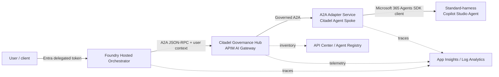

# Plan: Foundry Orchestrator with Copilot Studio Agents via Citadel

## Problem and Conclusion

A Microsoft Foundry agent can act as the central orchestrator and invoke specialized
Copilot Studio agents through the Citadel Governance Hub and Azure API Management
(APIM/AI Gateway).

This is viable for production with an **A2A adapter layer**:

- A **standard-harness Copilot Studio agent** provides a supported programmable invocation
  path through the Microsoft 365 Agents SDK Copilot Studio client and can therefore sit
  behind this A2A adapter.
- A **GitHub Copilot-harness agent cannot currently sit behind this adapter**. The client
  library does not officially support that harness, and its Native app/Direct Line channel
  is not currently available. Microsoft 365 Copilot, Teams, demo website, and Web app iframe
  availability do not provide the programmatic contract this adapter needs.
- Copilot Studio can consume external A2A agents, but the current documentation does not
  provide a supported native method for publishing a Copilot Studio agent itself as an
  inbound A2A server.
- APIM can import, secure, observe, and rewrite an existing JSON-RPC A2A server and agent
  card, but it does not automatically convert Direct Line to A2A.
- APIM can publish REST operations as MCP tools. This exposes a bounded capability as a
  tool, but it does not turn a conversational Copilot Studio agent into a full A2A agent.
- The native outbound A2A tool in Foundry Agent Service is currently in preview. The use
  of non-GA functionality is accepted for this solution, so this is the preferred route.
  A custom A2A client remains a fallback only for technical incompatibility.

### Terminology and eligibility

Use **standard-harness agent**, not "classic agent," in architecture and operations
documentation. "Classic" is ambiguous: it can mean the older authoring experience, a legacy
Power Virtual Agents bot, or merely a local agent name. Harness eligibility must be confirmed
from how the agent was created and whether Copilot Studio exposes the Microsoft 365 Agents SDK
connection string.

| Agent category | Eligible as an A2A specialist through this adapter? | Planned treatment |
| --- | --- | --- |
| Standard-harness Copilot Studio agent | Yes | Publish, obtain its SDK connection string, configure `Harness=Standard`, and smoke-test through A2A. |
| GitHub Copilot-harness Copilot Studio agent | No | Reject during agent selection; create a standard-harness replacement if A2A is required. |
| External A2A agent consumed by Copilot Studio | Not through this adapter | Treat as the reverse integration direction and connect it using Copilot Studio's A2A consumer feature. |
| Power Virtual Agents classic bot | Unknown from that label alone | Verify or migrate it to a supported standard-harness agent before onboarding. |

## Protocol Selection

| Protocol | Role in the Target Architecture | Recommendation |
| --- | --- | --- |
| A2A | Agent discovery, delegation, context, and task lifecycle | Primary protocol between the orchestrator and specialist agents |
| REST | Underlying adapter and management API; optional integration for traditional clients | Support it, but do not expose Direct Line publicly |
| MCP | Publish explicit, deterministic agent capabilities as tools | Use only as a complement; do not use it as a generic chat-agent wrapper |

## Target Architecture



The adapter can host multiple eligible standard-harness Copilot Studio agents. The initial
development infrastructure exposes the multi-agent adapter as one APIM A2A API. A production
rollout can split agents into separate APIs, products, scopes, rate limits, and deployment
versions when authorization or lifecycle isolation requires it.

## Validation Status

A working reproduction exists at `repro/foundry-copilot-a2a` (.NET 10 A2A adapter plus a
deterministic mock Copilot Studio backend). What has actually been observed working, as
opposed to designed:

| Claim | Status |
| --- | --- |
| Foundry agent invokes an external A2A agent through the preview `a2a_preview` tool | Proven end to end |
| Adapter serves a valid agent card and JSON-RPC runtime for both A2A 1.0 and 0.3 | Proven |
| `contextId` maps to a backend conversation across turns | Proven against the mock |
| Replay of a `messageId` with different content is refused and never reaches the backend | Proven by live probe and regression test |
| Cross-caller and cross-tenant isolation of the idempotency cache | Proven under authentication, and mutation-checked |
| Adapter refuses to start unauthenticated unless explicitly opted in | Proven |
| Delegated user token through OBO into a real Copilot Studio agent | Proven: token validated, exchanged, and a live Copilot Studio conversation opened |
| A published standard-harness Copilot Studio agent answering through the adapter | Proven: real agent text relayed as an A2A message |
| A GitHub Copilot-harness agent answering through the adapter | Unsupported: two live agents returned the retired Enhanced Task Completion notice over HTTP 200 |
| `contextId` maps to one Copilot Studio conversation across turns | Proven against a live published agent, not just the mock |
| Replay refusal and idempotency against a live backend | Proven: refused calls never reach Copilot Studio |
| OAuthCard `signin/tokenExchange` SSO | Implemented, never executed |
| APIM/Citadel governance | Layer 1 Bicep generated and locally validated; not deployed |
| Adapter Azure hosting | ACR, managed identity, Key Vault, and single-replica Container Apps Bicep generated; not deployed |

### Protocol finding: A2A version mismatch

The Foundry `a2a_preview` tool is effectively **A2A 0.3** even though 1.0 is documented. It
fetches `/.well-known/agent-card.json` with no `A2A-Version` header, deserializes the card
as 0.3, and calls the legacy JSON-RPC method names. The .NET `A2A` SDK is 1.0. A
compatibility layer that serves both card shapes and both method sets is therefore
mandatory today. Plan for this in the adapter contract rather than assuming version
negotiation works.

### Security finding: idempotency caches are an access-control boundary

An idempotency cache keyed only on `messageId` is a cross-caller disclosure channel: a
second caller who replays another caller's `messageId` is served the first caller's
response. The key must include the caller identity and the conversation, and the entry must
be bound to a hash of the request payload so a reused identifier with different content is
refused rather than served. This must be treated as a contract requirement for any adapter
built to this plan, and it must be tested, because transport-level tests pass regardless.

### Identity finding: the delegated chain works, and its failure modes are configuration

The OBO chain was executed end to end against two real tenants: a user token minted for the
adapter's Application ID URI was validated by the adapter, exchanged through OBO for
`https://api.powerplatform.com/.default`, and used to drive a real Copilot Studio conversation.
In the second tenant the agent was genuinely published, so the orchestrator-facing call
returned the agent's own text. This removes the single largest risk in this plan: the
architecture is confirmed, not merely designed.

Three configuration details caused the failures along the way, and each should be treated as a
checklist item rather than rediscovered:

- **Token version.** Entra issues both v1.0 (`sts.windows.net`) and v2.0
  (`login.microsoftonline.com/<tenant>/v2.0`) issuers, and the caller decides which. Setting
  `requestedAccessTokenVersion: 2` does not stop a v1.0 client such as the Azure CLI from
  presenting a v1.0 token. An API that validates only the v2.0 issuer rejects legitimate
  callers with an opaque 401. Accept both issuer forms for the configured tenant explicitly,
  and both the `api://<id>` and bare-id audience forms — never by relaxing validation. APIM
  needs the same treatment in its `validate-jwt` policy.
- **Power Platform cloud.** `ConnectionSettings.Cloud` defaults to `Unknown` and throws
  during DI construction, so the service fails to start rather than failing a request.
- **Agent addressing.** Prefer the direct connection URL that Copilot Studio publishes.
  Deriving the environment host by hand is error-prone: default environments have no separate
  GUID, the ID is literally `Default-<tenant-id>`, and truncating the prefix yields a hostname
  that does not resolve. Configuration validation must accept the connection URL as a complete
  address; requiring environment plus schema name alongside it rejects the value makers are
  actually given.

A fourth point matters for delegating this work: **tenant-wide admin consent is not required
for the pilot.** `CopilotStudio.Copilots.Invoke` is user-consentable, so an operator without
consent rights can still prove the chain with a per-user (`Principal`) grant. That is also the
better default — the grant is scoped to one consenting user rather than the whole directory.

### Environment finding: Copilot Studio health is invisible to the transport

The first test tenant could not complete the final hop, and the reason is worth carrying into
rollout planning. Every agent returned `LatestPublishedVersionNotFound` because none had been
published, and publishing was refused with `UserViralLicenseExpired` even for a tenant admin.
The `CCIBOTS_PRIVPREV_VIRAL` licence was still assigned and the directory subscription still
reported `Enabled`; only the self-service trial behind it had lapsed. The Dataverse
`PvaPublish` action compounds this by returning HTTP 200 with an empty
`PublishedBotContentId` — a silent no-op.

Two genuinely published GitHub Copilot-harness agents reached the Copilot Studio service but
answered with

```text
Enhanced task completion preview has ended. Go to copilotstudio.microsoft.com and republish the agent.
```

This is a harness-compatibility failure, not evidence that the GitHub Copilot-harness agents
can be consumed successfully. Copilot Studio returned the notice as an ordinary message with
HTTP 200, so neither the transport nor the A2A envelope marked it as a failure.

Four consequences for the plan: provision proper Copilot Studio licensing before the pilot
rather than relying on trial entitlements; admit only standard-harness agents; verify each
specialist is currently published; and make content-level health detection an explicit
orchestrator requirement. A status code alone cannot prove that the selected agent returned a
valid answer.

## Identity and Consent Model

Per-user identity is a hard requirement. The intended chain is:

1. The user signs in to the client/orchestrator with Entra ID.
2. The Foundry orchestrator uses OAuth identity passthrough or performs its own OAuth/OBO
   flow in a Hosted Agent.
3. APIM validates the issuer, audience, tenant, scopes, and relevant claims. Tokens never
   become part of prompts, tool arguments, or telemetry.
4. The adapter validates the user assertion again and exchanges it through OBO for the
   scope required by the supported Copilot Studio invocation client.
5. Copilot Studio and its connectors continue to operate within that user's permissions,
   DLP policies, and Advanced Connector Policies.

The first technical spike must prove that the selected Foundry runtime securely exposes
the required user token and that the Microsoft 365 Agents SDK/Copilot Studio accepts the
OBO token. If this does not work end to end, the implementation must not fall back to
maker-owned connections. Instead, introduce a thin authenticated orchestration API for
Foundry that manages the identity flow.

## Adapter Contract

The A2A adapter:

- admits only Copilot Studio agents explicitly classified as `Harness=Standard`;
- exposes incompatible configured agents as unsupported in discovery and rejects them before
  OBO or backend network traffic;
- publishes an agent card with stable capability IDs, examples, versions, and supported
  input/output modes;
- supports JSON-RPC A2A and initially uses non-streaming text;
- maps `contextId` to the Copilot Studio `conversationId` and stores only minimal,
  encrypted session state with a TTL;
- uses `messageId` for idempotency and replay protection;
- maps failures to explicit A2A task/status responses;
- applies timeouts, cancellation, and bounded retries without repeating side effects;
- excludes secrets, bearer tokens, and personal data from logs;
- exposes health and readiness endpoints separately from the A2A runtime.

Attachments, adaptive cards, human handoff, push notifications, and long-running
background tasks are outside the first release and will be added only after protocol
compatibility testing.

## Citadel/APIM Configuration

- Place APIM in the Citadel Governance Hub as the only governed entry point.
- Import the adapter as an A2A agent API; its configured public base URL makes the served
  agent card advertise APIM.
- Use Entra OAuth for clients. The development template accepts a public HTTPS adapter
  backend; production requires private connectivity and a separate network design.
- Add rate limits, quotas, request-size limits, schema validation, correlation IDs, kill
  switches, and allowlists.
- Log metadata only by default. Keep prompt and response-body logging disabled for
  personalized calls.
- Do not use semantic caching for user-scoped agent responses.
- Register agent cards and optional MCP tools in the API Center/Foundry inventory.
- Publish only explicitly selected REST operations as MCP tools; APIM supports MCP tools
  in this pattern, not MCP resources or prompts.

## Implementation Plan

1. **Run the protocol and identity spike**
   - Validate the native Foundry A2A tool with OAuth identity passthrough.
   - Prove delegated identity, consent, and OBO through to a test agent using user-scoped
     data.
   - Define a versioned A2A contract and agent card.
2. **Build the A2A adapter**
   - Implement the A2A server, Copilot Studio invocation client, session mapping,
     idempotency, error translation, and secure token handling.
3. **Qualify and onboard Copilot Studio specialists**
   - Record each candidate's harness; do not infer it from its display name or schema name.
   - For each standard-harness agent, publish it, obtain its Microsoft 365 Agents SDK
     connection string, configure it as `Harness=Standard`, and run an authenticated A2A
     smoke test that requires real domain output.
   - For each GitHub Copilot-harness candidate, either use its supported user-facing channel
     outside this architecture or build a standard-harness replacement with equivalent
     instructions, knowledge, tools, and authentication.
4. **Onboard the adapter to Citadel/APIM**
   - Import the agent card and runtime, then configure OAuth, private backend
     connectivity, policies, products, scopes, and registry metadata.
5. **Integrate the Foundry orchestrator**
   - Add specialist discovery and routing, and connect through APIM.
   - Use the native A2A tool; implement a custom A2A client in a Hosted Agent only if an
     incompatibility is found.
6. **Add observability and governance**
   - Propagate W3C trace context and correlation IDs.
   - Create dashboards for latency, failures, delegations, consent, and policy denials
     without sensitive payloads.
7. **Run contract, security, and load tests**
   - Test tenant/user isolation, consent revocation, prompt injection, replay, retries,
     timeouts, agent-card versioning, and fail-closed behavior.
8. **Roll out in stages**
   - Start with two specialist agents, non-streaming text, and allowlisted users.
   - Promote only after the identity and preview-risk criteria have passed.

## Acceptance Criteria

- The Foundry orchestrator routes two distinct intents through APIM to two standard-harness
  Copilot Studio agents.
- Every onboarded Copilot Studio specialist has recorded harness evidence and a verified
  Microsoft 365 Agents SDK connection string.
- GitHub Copilot-harness agents are absent from the callable catalog or are marked unsupported,
  and selecting one produces no OBO or Copilot Studio network call.
- APIM endpoints return valid agent cards and A2A JSON-RPC responses.
- User A cannot access user B's data or connector permissions through any route.
- Revoking consent blocks new delegations without falling back to shared credentials.
- Adapter backends are not directly reachable from the public network.
- A single trace ID correlates the orchestrator, APIM, adapter, and Copilot call.
- Tokens, secrets, and prompt/response bodies do not appear in logs by default.
- Timeouts, retries, and duplicate messages do not cause duplicate side effects.
- A kill switch can disable each agent independently.

## Key Risks and Decisions

- **Foundry A2A tool:** Preview status is explicitly accepted. The tool is currently behind
  the documented protocol version (it behaves as A2A 0.3), so ship a dual-version
  compatibility layer and pin it with contract tests rather than trusting negotiation.
- **Copilot Studio inbound A2A:** An adapter is required until a supported native provider
  endpoint becomes available.
- **Copilot Studio harness compatibility:** Only standard-harness agents are eligible for the
  current adapter. GitHub Copilot-harness agents must remain blocked until Microsoft documents
  a supported programmatic channel and the repository validates it end to end. Republishing or
  setting `Harness=Standard` does not convert an agent.
- **Copilot Studio channel authentication:** The Entra auth provider on the Copilot Studio
  channel must use **client secrets**. Federated credentials are rejected with
  `IntegratedAuthenticationNotSupportedInChannel`. This constrains the secret-management
  story and must be handled with a Key Vault-backed rotation process; the adapter's own
  credential can still be certificate-based.
- **Identity:** Maker-owned or shared Power Platform connections are not an acceptable
  fallback for user-scoped data. The adapter must fail closed when it cannot establish the
  caller, because caches are partitioned on that identity. The delegated OBO chain itself is
  now proven, so the residual risk is configuration, not feasibility.
- **Copilot Studio licensing and health:** A lapsed self-service ("viral") Copilot Studio
  entitlement silently closes the authoring and publishing plane while still reporting an
  assigned licence. Confirm real licensing before the pilot. More importantly, treat
  `LatestPublishedVersionNotFound` and `Enhanced task completion preview has ended` as
  monitored conditions: Copilot Studio reports licensing, publishing and preview-expiry
  problems as ordinary agent messages with HTTP 200, so a degraded agent is indistinguishable
  from a healthy one at the protocol level.
- **Replay and idempotency:** Treat the idempotency cache as an access-control boundary,
  not an optimisation. In-process caches also mean replay protection is per-replica, so
  move to shared encrypted storage before scaling out.
- **MCP semantics:** Publish bounded tools only; do not expose a generic conversation as
  one unbounded MCP tool.
- **Protocol scope:** The first release is text-only and non-streaming to keep differences
  between A2A, APIM, and Copilot Studio manageable.

## Sources

- [Foundry Citadel Platform](https://github.com/Azure-Samples/foundry-citadel-platform)
- [AI gateway in Azure API Management](https://learn.microsoft.com/azure/api-management/genai-gateway-capabilities)
- [Import an A2A agent API](https://learn.microsoft.com/azure/api-management/agent-to-agent-api)
- [Foundry A2A tool](https://learn.microsoft.com/azure/foundry/agents/how-to/tools/agent-to-agent)
- [Foundry A2A authentication](https://learn.microsoft.com/azure/foundry/agents/concepts/agent-to-agent-authentication)
- [Reference implementation: bradrlaw/copilot-studio-a2a](https://github.com/bradrlaw/copilot-studio-a2a)
  (Microsoft-authored; useful for the Entra/Copilot Studio setup steps, but note it starts a
  new conversation per request and is A2A 0.3 only)
- [Copilot Studio and external A2A agents](https://learn.microsoft.com/microsoft-copilot-studio/add-agent-agent-to-agent)
- [Copilot Studio custom app integration](https://learn.microsoft.com/microsoft-copilot-studio/publication-integrate-web-or-native-app-m365-agents-sdk)
- [Integrate Copilot Studio with Microsoft 365 Agents SDK](https://learn.microsoft.com/microsoft-365/agents-sdk/integrate-with-mcs)
- [Harnesses in Copilot Studio](https://learn.microsoft.com/microsoft-copilot-studio/harnesses-overview)
- [Access standard harness agents and agent flows](https://learn.microsoft.com/microsoft-copilot-studio/agents-experience/switch-experiences)
- [Available channels for GitHub Copilot-harness agents](https://learn.microsoft.com/microsoft-copilot-studio/agents-experience/publication-channels-overview)
- [Expose REST APIs as MCP tools in APIM](https://learn.microsoft.com/azure/api-management/export-rest-mcp-server)
